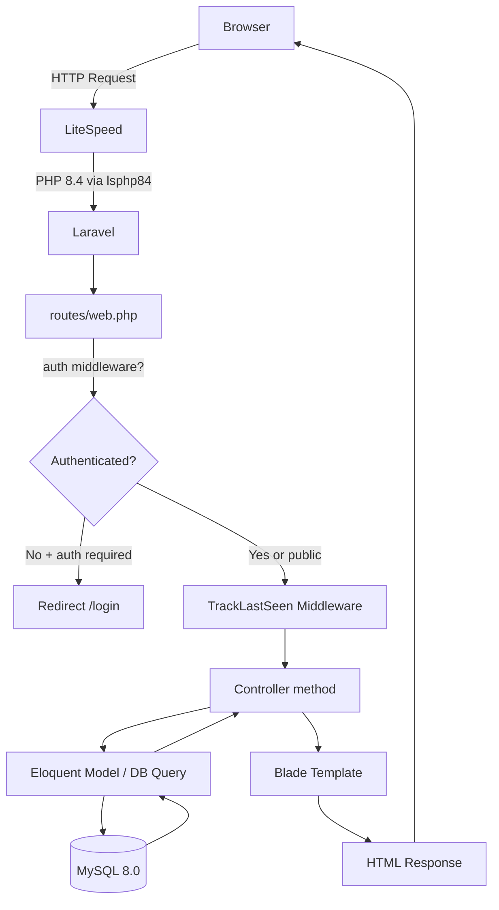
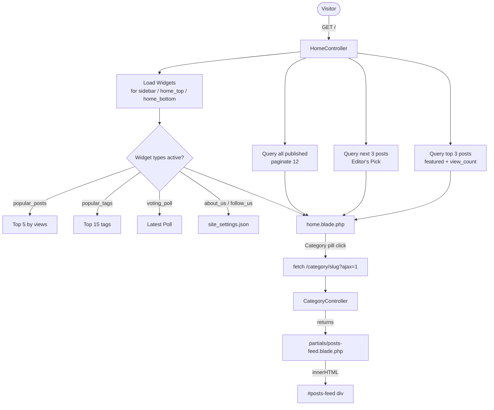
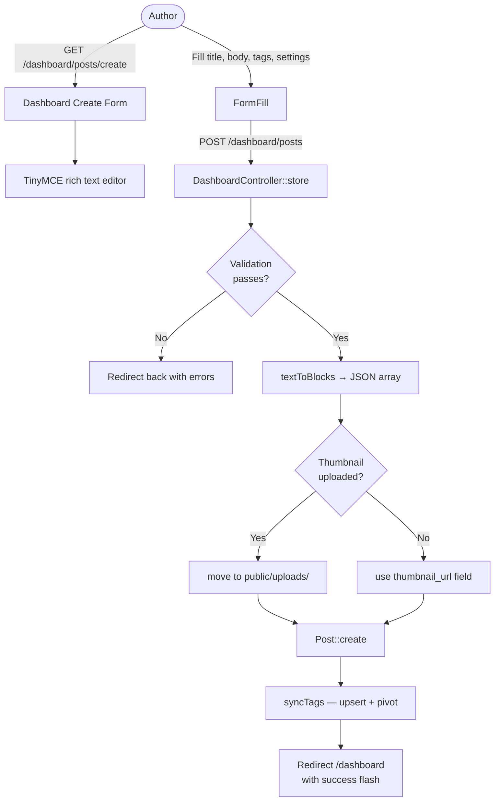
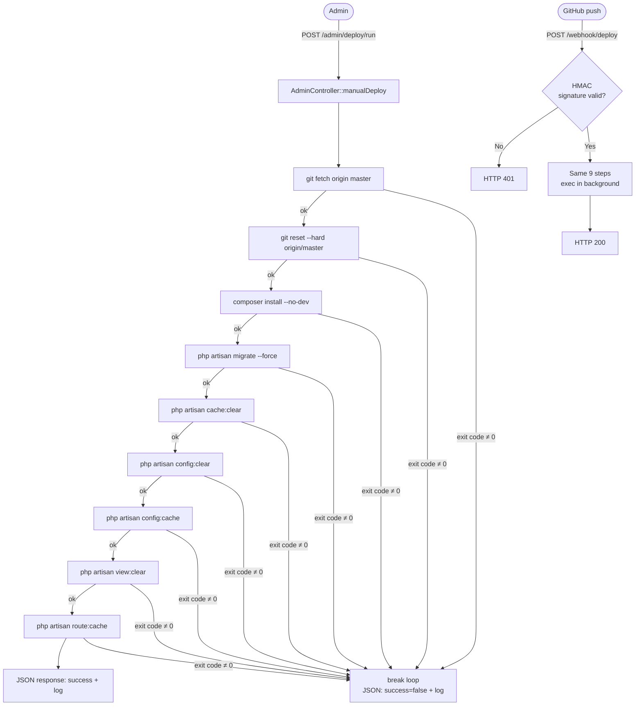
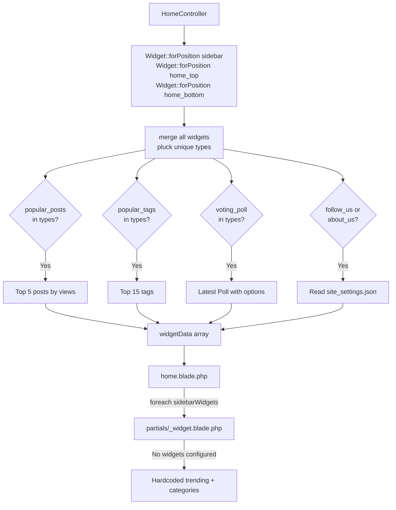
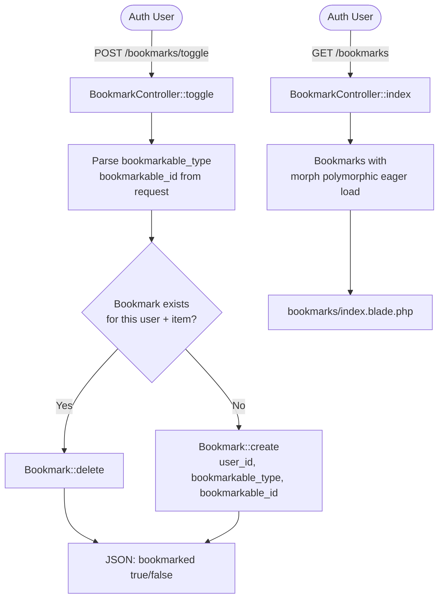
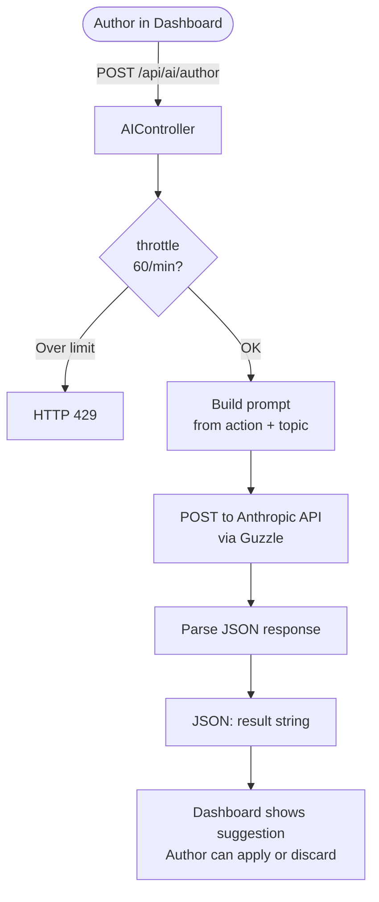
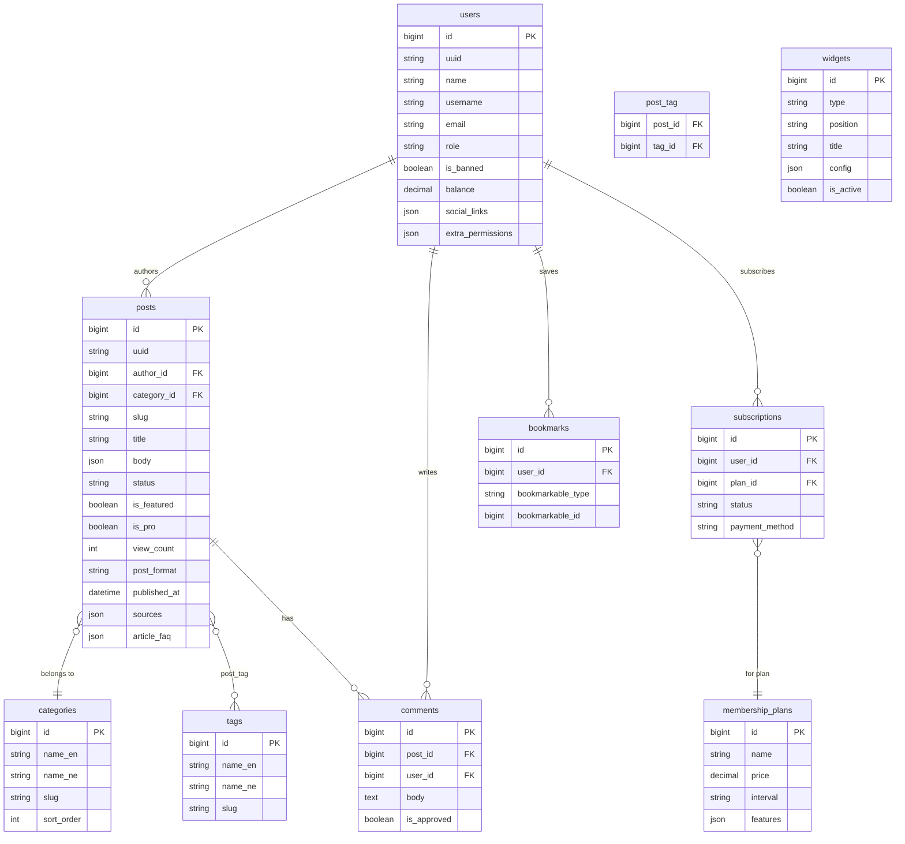

# nkhoj — System Flowcharts

Mermaid diagrams for all major system flows.

---

## 1. Request Lifecycle



---

## 2. Homepage Feed Flow



---

## 3. Post Publish Flow (Author)



---

## 4. Post Edit & Toggle Flow

```mermaid
flowchart TD
    Author([Author]) -->|GET /dashboard/posts/id/edit| EditForm[edit.blade.php\nAlpine.js editForm]

    EditForm --> AlpineInit[init: parse currentTags\nload sources, FAQ, toggles]

    subgraph Toggle Flow
        ClickToggle([Click toggle div]) --> AlpineToggle[on = !on\nAlpine state updates]
        AlpineToggle --> HiddenInput[hidden input :value = on ? 1 : 0\nreactive binding]
    end

    subgraph Tags Flow
        AddTag([Press Enter / comma]) --> PushTag[tags.push tag]
        PushTag --> HiddenTags[hidden input :value = tags.join comma\nlive reactive]
    end

    Author -->|Submit| FormSubmit[@submit handler\nsets tagsHidden value]
    FormSubmit -->|PUT /dashboard/posts/id| DashboardUpdate[DashboardController::update]
    DashboardUpdate --> ValidateUpdate{Validation}
    ValidateUpdate -->|Yes| SavePost[post.update with all fields\nbooleans cast correctly]
    SavePost --> SyncTagsU[syncTags]
    SyncTagsU --> RedirectDash[Redirect /dashboard]
```

---

## 5. Authentication Flow

```mermaid
flowchart TD
    Visitor([Visitor]) --> LoginPage[GET /login]
    LoginPage -->|POST /login| AuthLogin[AuthController::login]
    AuthLogin --> CheckBanned{is_banned?}
    CheckBanned -->|Yes| DenyLogin[Back with error: banned]
    CheckBanned -->|No| VerifyPassword{Password correct?}
    VerifyPassword -->|No| FailLogin[Back with error]
    VerifyPassword -->|Yes| SessionLogin[auth()->login\nSession regenerate]
    SessionLogin --> TrackHistory[LoginHistory::create\nIP + user agent]
    TrackHistory --> RedirectHome[Redirect /]

    Visitor -->|GET /auth/google/redirect| Socialite[SocialAuthController::redirect]
    Socialite --> GoogleOAuth[Google OAuth consent]
    GoogleOAuth -->|Callback| SocialCallback[SocialAuthController::callback]
    SocialCallback --> FindOrCreate{User exists?}
    FindOrCreate -->|No| CreateUser[User::create\nSocialAccount::create]
    FindOrCreate -->|Yes| LinkAccount[SocialAccount::updateOrCreate]
    CreateUser & LinkAccount --> SessionLoginOAuth[auth()->login]
    SessionLoginOAuth --> RedirectHome
```

---

## 6. Admin Deploy Flow



---

## 7. Widget Rendering Flow



---

## 8. Bookmark Flow (Polymorphic)



---

## 9. AI Content Generation Flow



---

## 10. Database Schema (Core Relations)


